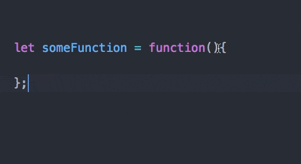
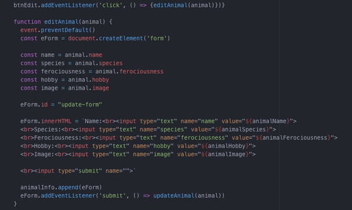

# **JavaScript - V - `.fetch()` e conceito de dependências**
## Instruções Iniciais:

1. Forkem o repositório para a conta pessoal de vocês.
2. Clonem no computador de vocês o repositório forkado em suas contas particulares.

**_ATENÇÃO_: Não modifiquem o conteúdo do projeto original forkado, apenas a que você copiou e renomeou!**

### Façam suas perguntas através do DontPad

[http://dontpad.com/On13-JSV](http://dontpad.com/On13-JSV)

----

## **1. async/await**

A palavra-chave `async` é usada em declarações ou expressões de funções. Assim, elas se tornam funções assíncronas e permitem o uso do `await` dentro delas.

Elas normalmente são usadas quando é necessário esperar a resolução desta para dar continuidade às operações seguintes.

Ou seja, o `async` faz com que uma função automaticamente retorne uma Promise.

Ao se usar o `async`, você deve marcar com o `await` as funções e métodos que retornarão uma Promise.

```JavaScript
function resolveDoisSegundos(x) {
  return new Promise(resolve => {
    setTimeout(() => {
      resolve(x);
    }, 2000);
  });
};

const expFuncaoAsync = async x => {
  const a = await resolveDoisSegundos(20); // aguarda essa promise ser resolvida antes de continuar
  return x + a;
};
```

O `await` pausa a função `expFuncaoAsync()`, marcada com o `async`, até que a Promise dentro da função `resolveDoisSegundos()` seja resolvida. Então o valor retornado é atribuído à variável e o código de `expFuncaoAsync()` continua de onde parou.

### **async/await ou then()?**

Percebam que o `async/await` podem ser utilizados para criar uma requisição assíncrona ao invés de uma `Promise`. Mas, aí fica a dúvida: qual eu devo utilizar?

Primeiramente, é preciso dizer que a chegada do `async/await` não excluiu o uso de Promises - já que o seu uso marca o uso de uma requisição assíncrona e o retorno de uma Promise. O que o `async/await` faz é simplificar o uso das Promises.   

```JavaScript

async function getDados(url) {
    const response = await fetch(url);
    const json = await response.json();
    return json;
}
getDados(url)
      .then(res => console.log(res))
      .catch(err => console.error(err));

```

Pessoalmente, eu entendo que `async/await` deixa o código mais legível e fácil de entender ao invés de concatenar vários `then()`.

Por outro lado, o comando `await` só funciona dentro de uma função `async` - que precisa ser criado apenas para poder executar o comando `await`, enquanto as Promises com o `then()` podem ser usadas em qualquer lugar.

Há também questões mais técnicas de performance, tratamento de erros e memória - mas, considerando que essa aula é mais inicial, deixo esse artigo para quem quiser se aprofundar sobre o tema: https://blog.pusher.com/promises-async-await/.

---
## **2. Arrow functions**

Você sabia que é possível declarar uma função de um jeito diferente? Sim, para isso nós utilizamos as arrows functions!



Uma expressão arrow function possui uma sintaxe mais curta quando comparada a uma expressão de função. 

A sua sintaxe mais comum é essa:

``` Javascript
const minhaFuncao = (param1, param2, ...) => {
  //passos da minha função

  return meuResultado
}
```

E ela pode ser ainda mais diminuta! Se a função tem apenas um único parâmetro e esse parâmetro retorna um valor, você pode remover as chaves e a palavra `return`.


``` Javascript
const minhaFuncao = (param1) => meuResultado;
```

Aliás, a arrow function pode ser escrita ainda nesse formato ainda mais simples - **que nós vamos usar bastante quando tratarmos sobre métodos de array**:

``` Javascript
(param1) => meuResultado; // um jeito

(param1) => {
  return meuResultado
};

```
---

## **3. Operador *spread* (ou o famoso "...")**

O *spread operator* permite que um objeto iterável se expanda em locais onde não é esperado nenhum novo argumento.

Ok... mas, como podemos tornar essa explicação mais fácil?

Primeiramente, vamos dissecar o que é um objeto iterável? Objeto iterável é um objeto que pode ser objeto de um laço (*loop*) - um `for()`, um `map()`, ou até mesmo um `keys()`. E quem pode ser objeto de um laço? Os nossos queridos arrays e objetos. 

Logo, por meio de um *spread operator*, é possível combinar em um mesmo local dois ou mais objetos iteráveis (arrays ou objetos).

### **1) Exemplo com objetos:**

```Javascript

const obj1 = {
  firstName: 'John',
  lastName: 'Doe'
};
const obj2 = {
  age: 25
};
const person = { ...obj1, ...obj2 };
console.log(person);

```

### **2) Exemplo com arrays:**

```Javascript

const numbers = [1,2,3,4,5];
console.log(numbers);  // output: [1,2,3,4,5]

```

---

## **3. Atribuição via desestruturação**

A sintaxe de atribuição via desestruturação (destructuring assignment) é uma expressão JavaScript que possibilita extrair dados de arrays ou objetos em variáveis distintas.



### **Exemplo de código:**

``` JavaScript
let arr = ["John", "Smith"]

let [firstName, surname] = arr;

alert(firstName); // John
alert(surname);  // Smith
```

Por meio de um array e objeto, é possível criar pequenos pacotes de informação. A atribuição via desestruturação usa sintaxe similar, mas no lado esquerdo da atribuição são definidos quais elementos devem ser extraídos da variável de origem.

``` JavaScript
var x = [1, 2, 3, 4, 5];
var [y, z] = x;
console.log(y); // 1
console.log(z); // 2
```

É até mesmo possível atribuir o valor de um ou mais itens, "perdendo" os outros valores.

```JavaScript
let [name1, name2] = ["Julius", "Caesar", "Consul", "of the Roman Republic"];

alert(name1); // Julius
alert(name2); // Caesar
// Perdi os outros dois valores
```
---

## **4. Introdução à dependências(lib) e NPM**

O Node.js foi responsável por criar um ambiente onde é possível rodar métodos e funções escritas em JavaScript.

Com isso, foi possível acrescentar ao uso da linguagem as famosas dependências (ou *libs*). *Libs* são bibliotecas que podem ser incluídas em um projeto Node de acordo com as necessidades de um projeto. Elas também podem ser chamadas de pacotes ou módulos.

**Exemplo:** você possui uma página HTML que disponibiliza uma tabela com dados para serem visualizados pelo usuário. Contudo, o seu gerente de projetos pediu para que seja incluída uma funcionalidade em que o usuário poderia exportar essa tabela em excel e baixa-la pelo navegador. 

Num caso como esse, você poderia criar todo um sistema no back-end para habilitar essa funcionalidade **ou** você poderia instalar e utilizar no seu projeto uma biblioteca que faça esse serviço - montagem e download de um excel (ex.: https://www.npmjs.com/package/xlsx).

Logo, é possível perceber que as bibliotecas trazem novos recursos e facilitam o trabalho de desenvolvimento de uma funcionalidade e aplicação.

Essas bibliotecas são armazenadas em gerenciadores de pacotes. O gerenciador padrão é o **NPM** (*Node Package Manager*). O NPM (https://www.npmjs.com/) gerencia essas bibliotecas e é instalada automaticamente com a instalação do Node.js em uma máquina.

O NPM também gerencia frameworks - como React, Vue.js e Angular.

Ao iniciar o npm em um projeto, é criado um arquivo chamado `package.json`. Nesse arquivo, as dependências instaladas são especificadas, incluindo informações como o seu nome e a versão instalada.

### **1. Comandos úteis do NPM (https://docs.npmjs.com/cli/v7/commands)**

**a. Inicialização do npm em um projeto e criação do package.json:**

`npm init`

**b. Gerenciamento dos arquivos de configuração do NPM**

`npm init`

**c. Instalação de uma biblioteca**

`npm install <nome-do-pacote> <opcional:versão>`

**d. Atualizar um pacote**

`npm update <nome-do-pacote> <opcional:versão>`

## **Links Úteis:**

### **async/await**

https://developer.mozilla.org/pt-BR/docs/Web/JavaScript/Reference/Operators/async_function

https://www.alura.com.br/artigos/async-await-no-javascript-o-que-e-e-quando-usar

https://blog.pusher.com/promises-async-await/

### ***Spread Operator***

https://developer.mozilla.org/pt-BR/docs/Web/JavaScript/Reference/Operators/Spread_syntax

https://devpleno.com/spread-operator

https://www.geeksforgeeks.org/javascript-spread-operator/

https://levelup.gitconnected.com/javascript-spread-operator-explained-es6-9784095b0364


### ***Destructucturing***

https://developer.mozilla.org/pt-BR/docs/Web/JavaScript/Reference/Operators/Destructuring_assignment

https://medium.com/@sylwiavargas/keep-javascript-short-destructuring-741c8a65a6e0

### **NPM e dependências**

https://nodejs.org/pt-br/download/package-manager/

https://docs.npmjs.com/cli/v7/commands

https://balta.io/blog/node-npm-instalacao-configuracao-e-primeiros-passos

https://rockcontent.com/br/blog/npm/

https://www.freecodecamp.org/news/the-difference-between-a-framework-and-a-library-bd133054023f/